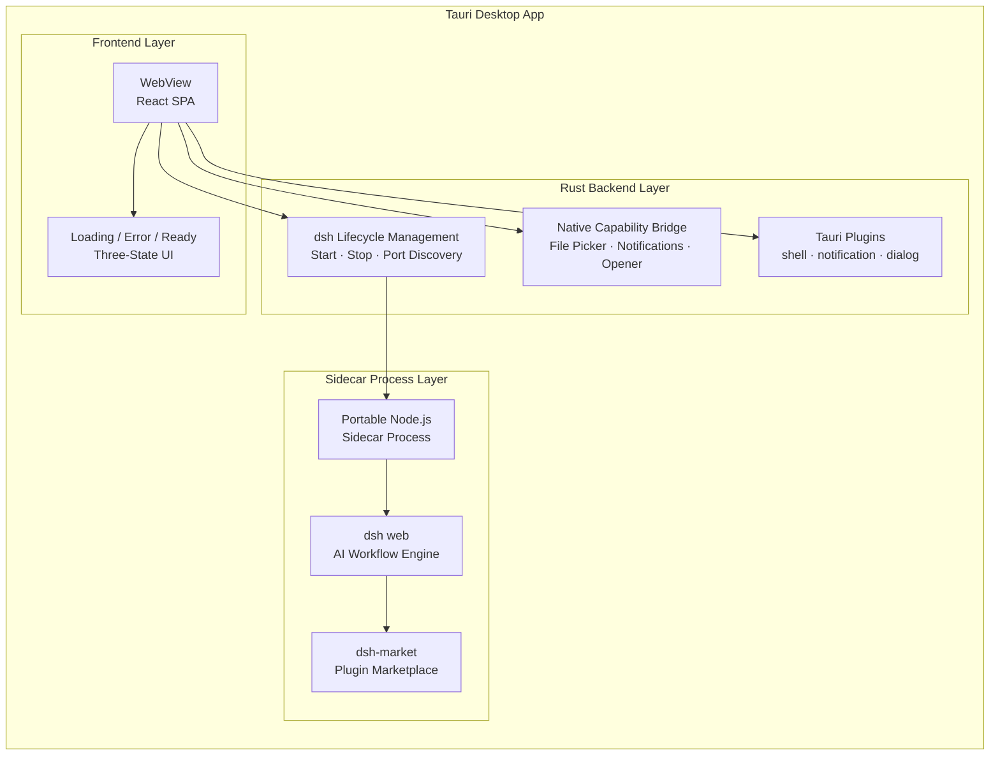
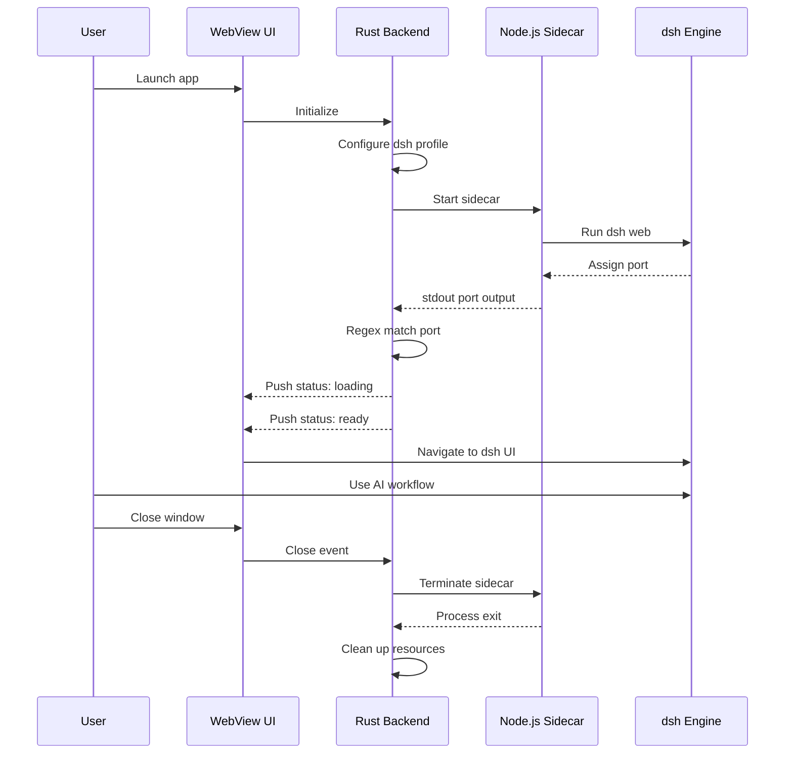

<h1 align="center">DeepSeek Harness Desktop</h1>

<p align="center">
  <strong>Native desktop shell for the deepseek-harness AI workflow engine</strong>
  <br>
  <em>将 AI 工作流框架 dsh 打包为原生桌面应用</em>
</p>

<p align="center">
  <a href="README.md">🌐 中文</a>
</p>

<p align="center">
  <a href="https://github.com/Nonnetta/deepseek-desktop/actions/workflows/ci.yml">
    
  </a>
  <a href="https://github.com/Nonnetta/deepseek-desktop/releases">
    
  </a>
  <a href="https://opensource.org/licenses/MIT">
    
  </a>
  
  
</p>

<br>

---

## 📸 Screenshots

<p align="center">
  <i>Loading screen · Application starting</i>
</p>

<p align="center">
  
</p>

> **💡 Note:** Place your actual screenshots in the `screenshots/` directory, and reference them here with the corresponding file paths.

---

## 📋 Overview

**DeepSeek Harness Desktop** is a [Tauri 2](https://v2.tauri.app/) desktop application that wraps DeepSeek's official [deepseek-harness](https://github.com/deepseek-ai/deepseek-harness) (abbreviated as **dsh**) AI workflow engine into a native desktop experience.

This is not a chatbot client — it's a **desktop shell for an AI workflow engine** that runs the dsh Web UI and bridges native capabilities like filesystem access, system notifications, and local file opening.

---

## ✨ Features

### 🚀 Lightweight & Native
Built with Tauri 2, using the system's native WebView — no Chromium bundled. Small package size, low memory footprint, instant startup.

### 🖥️ Cross-Platform
Supports **macOS** (ARM64 / x64), **Windows** (x64), and **Linux** (x64 / ARM64) — one codebase, multiple platforms.

### 📦 Self-Contained
Automatically downloads the platform-specific portable Node.js binary at build time, copies and prunes dsh dependencies. The final artifact is **ready to use out of the box** — no runtime installation required.

### 🔌 Plugin Marketplace
Built-in [dsh-market](https://github.com/dsh-market/dsh-market) plugin marketplace with **1,250+ community plugins** — one-click install, update management, hot-switching, backup and restore.

### 🎯 Build Optimization
Automatically removes build-time dependencies like `typescript`, `vite`, `esbuild`, keeping only the current platform's `node-pty` prebuild — minimizing package size.

### 🔗 Native OS Integration
System notifications, file dialogs, and default-program file opening via Tauri plugins.

### 🎬 Elegant Startup
Loading animation on launch with real-time status push: `loading → ready / error`.

### 🧹 Clean Shutdown
Automatically terminates the dsh sidecar process when the window closes — no residual processes.

---

## 🚀 Quick Start

```bash
# 1. Install dependencies + initialize environment
pnpm bootstrap

# 2. Development mode (with hot reload)
pnpm dev

# 3. Build production package
pnpm build

# 4. Clean build artifacts
pnpm clean
```

### Prerequisites

| Dependency | Version |
|------|---------|
| [Rust](https://rustup.rs/) | ≥ 1.77 |
| Node.js | ≥ 22.19 or ≥ 24 |
| [pnpm](https://pnpm.io/) | ≥ 11.7 |
| Tauri system deps | See [Tauri docs](https://tauri.app/start/prerequisites/) |

#### macOS

```bash
xcode-select --install
```

#### Windows

- [Microsoft Visual Studio C++ Build Tools](https://visualstudio.microsoft.com/visual-cpp-build-tools/)
- [WebView2](https://developer.microsoft.com/en-us/microsoft-edge/webview2/) (built into Windows 10+)

#### Linux

```bash
sudo apt install libwebkit2gtk-4.1-dev build-essential curl wget file \
  libxdo-dev libssl-dev libayatana-appindicator3-dev librsvg2-dev
```

### Commands Reference

| Command | Purpose |
|---------|---------|
| `pnpm bootstrap` | Install deps + init environment |
| `pnpm dev` | Development mode (hot reload) |
| `pnpm build` | Build current platform |
| `pnpm build macos` | Build macOS (ARM64) |
| `pnpm build windows` | Build Windows (x64) |
| `pnpm build linux` | Build Linux (x64) |
| `pnpm build all` | Build all platforms |
| `pnpm clean` | Clean all build artifacts |

---

## 🏗️ Architecture

### System Architecture



### Workflow



### State Machine

| State | Meaning | UI |
|-------|---------|-----|
| `loading` | Sidecar starting, waiting for port | Spinner + progress bar animation |
| `ready` | Sidecar ready, navigating to dsh UI | Full dsh interface |
| `error` | Startup failed (dsh not found, port timeout, etc.) | Red error message with details |

---

## 📁 Project Structure

```
dsh-desktop/
├── .npmrc                             # pnpm configuration
├── pnpm-workspace.yaml                # Workspace definition
├── package.json                       # Root orchestration scripts
├── scripts/
│   ├── install.js                     # Install dependencies
│   ├── build.js                       # Multi-platform build script
│   ├── dev.js                         # Dev mode entry
│   ├── clean.js                       # Cleanup script
│   └── fetch-node.js                  # Download portable Node.js
├── dsh-app-desktop/
│   ├── package.json                   # Sub-project (dshmarket included)
│   ├── vite.config.ts                 # Vite build config
│   ├── index.html                     # Splash/loading page
│   ├── src/                           # Frontend (React + TypeScript)
│   │   ├── main.tsx                   # Entry point
│   │   ├── App.tsx                    # State-aware startup UI
│   │   └── index.css                  # Styles
│   └── src-tauri/                     # Backend (Rust + Tauri)
│       ├── Cargo.toml                 # Rust dependencies
│       ├── build.rs                   # Build-time dsh resource copy
│       ├── tauri.conf.json            # Tauri configuration
│       ├── binaries/                  # Portable Node.js
│       ├── resources/dsh/             # dsh kernel
│       ├── capabilities/              # Permission config
│       └── src/
│           ├── main.rs                # Entry point
│           ├── lib.rs                 # App orchestration
│           ├── error.rs               # Error types
│           ├── paths.rs               # Path resolution
│           ├── dsh/                   # dsh lifecycle
│           │   ├── mod.rs
│           │   ├── port.rs            # Port discovery
│           │   ├── spawn.rs           # Process startup
│           │   └── shutdown.rs        # Process shutdown
│           ├── commands/              # Tauri commands
│           │   ├── mod.rs
│           │   ├── start.rs
│           │   ├── stop.rs
│           │   └── status.rs
│           └── capabilities/          # Native capabilities
│               ├── mod.rs
│               ├── file_picker.rs
│               ├── notifications.rs
│               └── opener.rs
└── screenshots/                       # Screenshots
```

---

## 🔧 Build Details

### Platform Mapping

| Platform | Rust Target Triple | Build Argument |
|----------|-------------------|----------------|
| macOS (ARM64) | `aarch64-apple-darwin` | `macos` |
| macOS (x64) | `x86_64-apple-darwin` | — |
| Windows (x64) | `x86_64-pc-windows-msvc` | `windows` |
| Linux (x64) | `x86_64-unknown-linux-gnu` | `linux` |

### Cross-Platform Build

Cross-compile Windows and Linux builds from macOS:

```bash
pnpm build all
```

### Build Optimization

The `build.rs` script automatically performs the following optimizations to minimize package size:

1. **dsh source copy** — Copies from `node_modules/@deepseek-ai/dsh` to the resource directory
2. **Dependency copy** — Copies runtime dependencies from pnpm virtual store (including dshmarket)
3. **Dependency pruning** — Removes `typescript`, `vite`, `esbuild` and other build-time deps
4. **Platform prebuild cleanup** — Keeps only the current platform's `node-pty` prebuild
5. **Documentation cleanup** — Removes `CHANGELOG.md`, `CONTRIBUTING.md`, etc.

### Build Artifacts

| Platform | Format | Path |
|----------|--------|------|
| macOS | `.dmg` / `.app` | `target/<triple>/release/bundle/macos/` |
| Windows | `.msi` / `.exe` | `target/<triple>/release/bundle/msi/` |
| Linux | `.deb` / `.AppImage` | `target/<triple>/release/bundle/deb/` |

---

## 🆙 Updating dsh

```bash
# Update the version in dsh-app-desktop/package.json
# Then run:
pnpm install
```

The version is declared in `dsh-app-desktop/package.json` under `dependencies`:

```json
"@deepseek-ai/dsh": "^0.1.0-rc.7"
```

---

## 🧩 Plugin Marketplace

This app comes pre-installed with [dsh-market](https://github.com/dsh-market/dsh-market). Navigate to **Settings → Plugin Market** after launch to:

- **Browse & Search** — 1,250+ community plugins with category filtering and keyword search
- **One-Click Install** — Install with a single click, real-time progress display
- **Update Management** — Update plugins individually or in bulk; the marketplace can self-update
- **Hot-Switching** — Enable/disable plugins without restarting
- **Backup & Restore** — JSON export/import, WebDAV auto-backup, GitHub Gist sync

The plugin marketplace is automatically configured on first launch — no additional setup required.

---

## 🧹 Cleanup

```bash
pnpm clean
```

Cleans the following:

| Path | Description |
|------|-------------|
| `node_modules/` | All dependencies |
| `dsh-app-desktop/node_modules/` | Workspace dependencies |
| `dsh-app-desktop/dist/` | Vite frontend build |
| `dsh-app-desktop/src-tauri/target/` | Rust compilation artifacts |
| `dsh-app-desktop/src-tauri/gen/` | Tauri code generation |
| `dsh-app-desktop/resources/dsh/` | dsh resource copy |
| `dsh-app-desktop/src-tauri/binaries/` | Downloaded Node.js |
| `.tmp/` | Temporary files |

---

## 📦 Package Notes

### macOS

Build artifacts are `.dmg` and `.app`, located at `dsh-app-desktop/src-tauri/target/aarch64-apple-darwin/release/bundle/`.

> **⚠️ macOS Note:** Since the app is not signed with an Apple Developer account, macOS Gatekeeper may display a "damaged" warning. Run the following command after installation:
> ```bash
> sudo xattr -rd com.apple.quarantine /Applications/DeepSeek\ Harness.app
> ```

### Windows

Build artifacts are `.msi` or `.exe`, located at `dsh-app-desktop/src-tauri/target/x86_64-pc-windows-msvc/release/bundle/`.

### Linux

Build artifacts are `.deb` and `.AppImage`, located at `dsh-app-desktop/src-tauri/target/x86_64-unknown-linux-gnu/release/bundle/`.

---

## ⚖️ Disclaimer

> **Third-party community project · Not affiliated with DeepSeek**
>
> This application is an **unofficial** third-party desktop shell, independently maintained by community developers. It does not represent DeepSeek and has no affiliation or relationship with DeepSeek (深度求索).
>
> This app merely provides a desktop environment for running [deepseek-harness](https://github.com/deepseek-ai/deepseek-harness). It **does not provide any AI models, API keys, or services**. Users are responsible for preparing and complying with the terms of service of the AI services they use.
>
> Users assume all risks. The developers are not liable for any direct or indirect damages arising from the use of this software.

---

## 🛠️ Tech Stack

| Layer | Technology |
|-------|-----------|
| Desktop Framework | [Tauri 2](https://v2.tauri.app/) |
| Backend Language | Rust |
| Frontend Framework | React 18 + TypeScript |
| Build Tool | Vite 5 |
| Package Manager | pnpm |
| AI Engine | [deepseek-harness](https://github.com/deepseek-ai/deepseek-harness) (dsh) |
| Plugin Marketplace | [dsh-market](https://github.com/dsh-market/dsh-market) |
| Native Plugins | shell, notification, dialog |

---

## 🔗 Related Projects

| Project | Description |
|---------|-------------|
| [deepseek-harness](https://github.com/deepseek-ai/deepseek-harness) | Official DeepSeek AI workflow engine (dsh), the core of this app |
| [@deepseek-ai/dsh](https://www.npmjs.com/package/@deepseek-ai/dsh) | dsh npm package with transparent version management |
| [dsh-market](https://github.com/dsh-market/dsh-market) | Community plugin marketplace with 1,250+ plugins |
| [Tauri 2](https://v2.tauri.app/) | Desktop framework used by this application |

---

## 📄 License

MIT — same as [deepseek-harness](https://github.com/deepseek-ai/deepseek-harness).

---

<p align="center">
  <sub>Built with ❤️ by the community</sub>
  <br>
  <sub>Not affiliated with DeepSeek</sub>
</p>