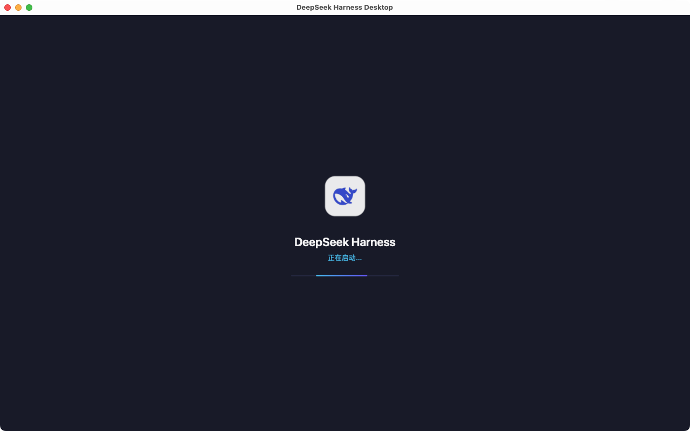
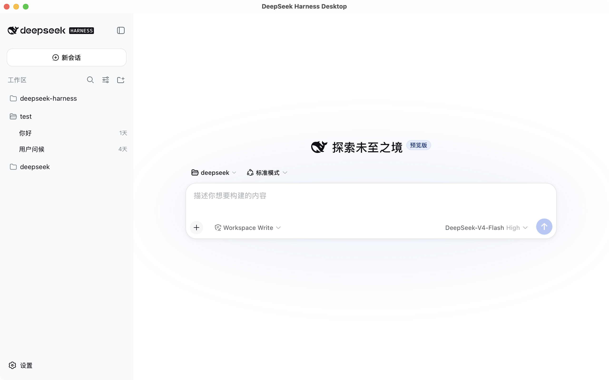
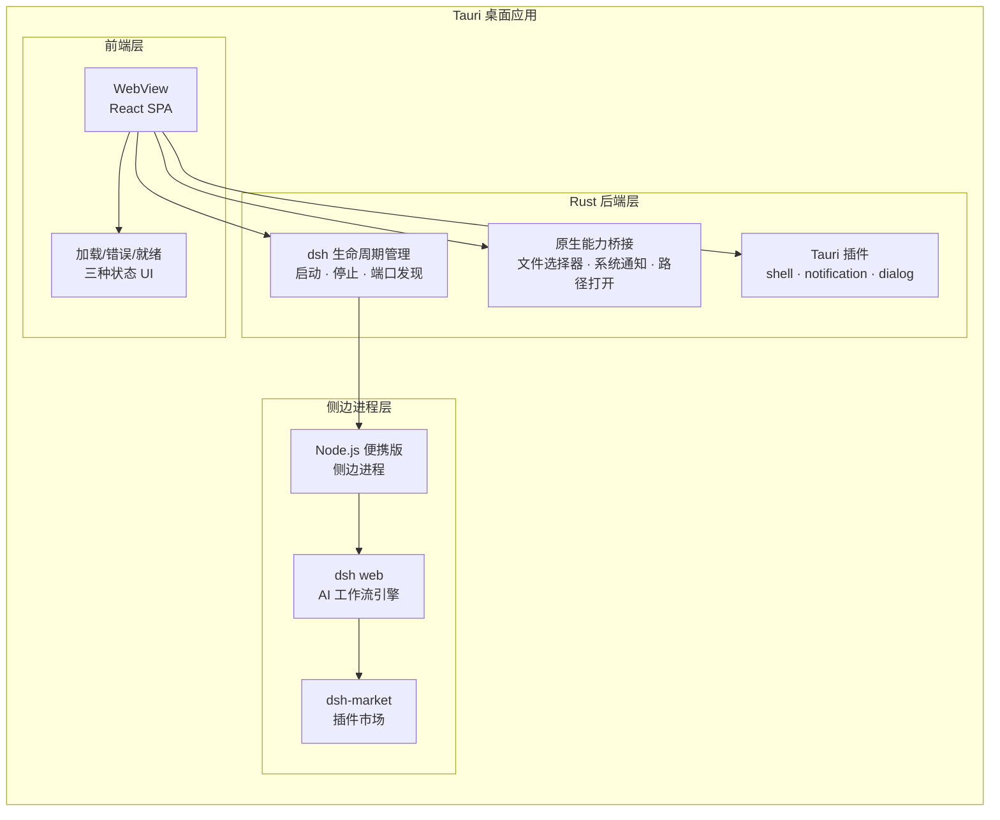
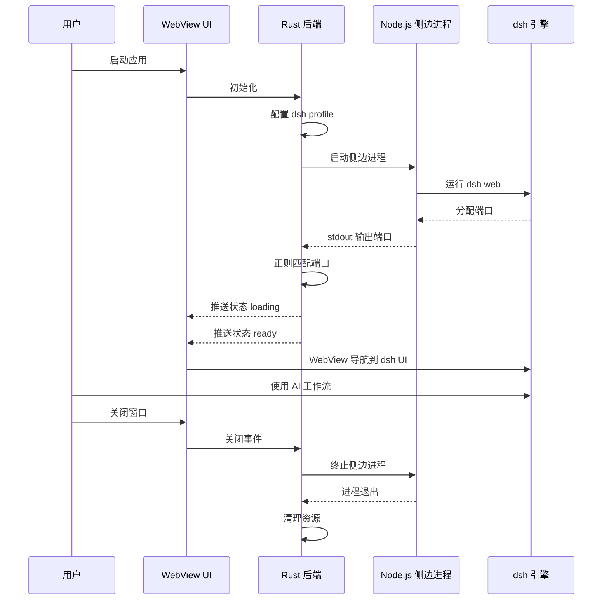

<h1 align="center">DeepSeek Harness Desktop</h1>

<p align="center">
  <strong>将 AI 工作流框架 dsh 打包为原生桌面应用</strong>
  <br>
  <em>Native desktop shell for the deepseek-harness AI workflow engine</em>
</p>

<p align="center">
  <a href="README.en.md">🌐 English</a>
</p>

<p align="center">
  <a href="https://github.com/Nonnetta/deepseek-desktop/releases">
    
  </a>
  <a href="https://opensource.org/licenses/MIT">
    
  </a>
  
  
</p>

<br>

---

## 📸 截图

<p align="center">
  <i>加载界面 · 启动中</i>
  <br>
  
</p>

<p align="center">
  <i>主体界面 · 与官方一致</i>
  <br>
  
</p>

---

## 📋 项目概述

**DeepSeek Harness Desktop** 是一个基于 [Tauri 2](https://v2.tauri.app/) 的桌面应用，将 DeepSeek 官方的 [deepseek-harness](https://github.com/deepseek-ai/deepseek-harness)（简称 **dsh**）AI 工作流引擎包装为原生桌面体验。

它不是一个聊天机器人客户端，而是一个 **AI 工作流引擎的桌面壳层** — 运行 dsh 的 Web UI，提供文件系统访问、系统通知、本地文件打开等原生能力桥接。

---

## ✨ 特性

### 🚀 原生轻量
基于 Tauri 2，使用系统原生 WebView，不捆绑 Chromium。包体积小、内存占用低，启动即用。

### 🖥️ 跨平台
支持 **macOS** (ARM64 / x64)、**Windows** (x64) 和 **Linux** (x64 / ARM64)，一套代码多端运行。

### 📦 自包含
构建时自动下载对应平台的便携 Node.js 二进制，拷贝并裁剪 dsh 依赖。最终产物**开箱即用**，用户无需安装任何运行时。

### 🔌 插件市场
内置 [dsh-market](https://github.com/dsh-market/dsh-market) 插件市场，支持 **1,250+ 社区插件**的一键安装、更新管理、热开关、备份恢复。

### 🎯 构建优化
自动移除 `typescript`、`vite`、`esbuild` 等构建时依赖，只保留当前平台的 `node-pty` prebuild，极致减小包体积。

### 🔗 原生 OS 集成
通过 Tauri 插件提供系统通知、文件对话框、默认程序打开文件等原生能力。

### 🎬 优雅启动
启动时展示加载动画，实时推送 `loading → ready / error` 状态，体验流畅。

### 🧹 干净关闭
窗口关闭时自动终止 dsh 侧边进程，无残留。

---

## 🚀 快速开始

```bash
# 1. 安装依赖 + 初始化环境
pnpm bootstrap

# 2. 开发模式（带热重载）
pnpm dev

# 3. 构建生产包
pnpm build

# 4. 清理构建产物
pnpm clean
```

### 前置条件

| 依赖 | 版本要求 |
|------|---------|
| [Rust](https://rustup.rs/) | ≥ 1.77 |
| Node.js | ≥ 22.19 或 ≥ 24 |
| [pnpm](https://pnpm.io/) | ≥ 11.7 |
| Tauri 系统依赖 | 见 [Tauri 文档](https://tauri.app/start/prerequisites/) |

#### macOS

```bash
xcode-select --install
```

#### Windows

- [Microsoft Visual Studio C++ 构建工具](https://visualstudio.microsoft.com/visual-cpp-build-tools/)
- [WebView2](https://developer.microsoft.com/en-us/microsoft-edge/webview2/)（Windows 10 以上已内置）

#### Linux

```bash
sudo apt install libwebkit2gtk-4.1-dev build-essential curl wget file \
  libxdo-dev libssl-dev libayatana-appindicator3-dev librsvg2-dev
```

### 命令参考

| 命令 | 用途 |
|------|------|
| `pnpm bootstrap` | 安装依赖 + 初始化环境 |
| `pnpm dev` | 开发模式（热重载） |
| `pnpm build` | 构建当前平台 |
| `pnpm build macos` | 构建 macOS (ARM64) |
| `pnpm build windows` | 构建 Windows (x64) |
| `pnpm build linux` | 构建 Linux (x64) |
| `pnpm build all` | 构建所有平台 |
| `pnpm clean` | 清理所有构建产物 |

---

## 🏗️ 架构

### 系统架构图



### 工作流程



### 状态机

| 状态 | 含义 | 用户界面 |
|------|------|---------|
| `loading` | 侧边进程启动中，等待端口 | 旋转圈 + 进度条动画 |
| `ready` | 侧边进程就绪，WebView 导航到 dsh UI | dsh 完整界面 |
| `error` | 启动失败（dsh 未找到、端口超时等） | 红色错误提示 + 详细信息 |

---

## 📁 项目结构

```
dsh-desktop/
├── .npmrc                             # pnpm 配置
├── pnpm-workspace.yaml                # 工作区定义
├── package.json                       # 根调度脚本
├── scripts/
│   ├── install.js                     # 安装依赖
│   ├── build.js                       # 多平台构建脚本
│   ├── dev.js                         # 开发模式入口
│   ├── clean.js                       # 清理脚本
│   └── fetch-node.js                  # 下载便携 Node.js
├── dsh-app-desktop/
│   ├── package.json                   # 子项目（含 dshmarket 依赖）
│   ├── vite.config.ts                 # Vite 构建配置
│   ├── index.html                     # 启动加载页
│   ├── src/                           # 前端 (React + TypeScript)
│   │   ├── main.tsx                   # 入口
│   │   ├── App.tsx                    # 状态感知的启动 UI
│   │   └── index.css                  # 样式
│   └── src-tauri/                     # 后端 (Rust + Tauri)
│       ├── Cargo.toml                 # Rust 依赖
│       ├── build.rs                   # 构建时拷贝 dsh 资源
│       ├── tauri.conf.json            # Tauri 配置
│       ├── binaries/                  # 便携 Node.js
│       ├── resources/dsh/             # dsh 内核
│       ├── capabilities/              # 权限配置
│       └── src/
│           ├── main.rs                # 入口
│           ├── lib.rs                 # 应用编排
│           ├── error.rs               # 错误类型
│           ├── paths.rs               # 路径解析
│           ├── dsh/                   # dsh 生命周期
│           │   ├── mod.rs
│           │   ├── port.rs            # 端口发现
│           │   ├── spawn.rs           # 进程启动
│           │   └── shutdown.rs        # 进程关闭
│           ├── commands/              # Tauri 命令
│           │   ├── mod.rs
│           │   ├── start.rs
│           │   ├── stop.rs
│           │   └── status.rs
│           └── capabilities/          # 原生能力
│               ├── mod.rs
│               ├── file_picker.rs
│               ├── notifications.rs
│               └── opener.rs
└── screenshots/                       # 截图
```

---

## 🔧 构建细节

### 平台映射

| 平台 | Rust 目标三元组 | 构建参数 |
|------|----------------|---------|
| macOS (ARM64) | `aarch64-apple-darwin` | `macos` |
| macOS (x64) | `x86_64-apple-darwin` | — |
| Windows (x64) | `x86_64-pc-windows-msvc` | `windows` |
| Linux (x64) | `x86_64-unknown-linux-gnu` | `linux` |

### 跨平台构建

在 macOS 上即可交叉编译 Windows 和 Linux 版本：

```bash
pnpm build all
```

### 构建优化流程

构建过程中 `build.rs` 自动执行以下优化，极致减小最终包体积：

1. **dsh 源码拷贝** — 从 `node_modules/@deepseek-ai/dsh` 拷贝到资源目录
2. **依赖拷贝** — 从 pnpm 虚拟存储拷贝运行所需依赖（含 dshmarket）
3. **依赖裁剪** — 移除 `typescript`、`vite`、`esbuild` 等构建时依赖
4. **平台预编译清理** — 只保留当前平台 `node-pty` 的 prebuild 文件
5. **文档清理** — 移除 `CHANGELOG.md`、`CONTRIBUTING.md` 等无用文件

### 构建产物

| 平台 | 产物格式 | 路径 |
|------|---------|------|
| macOS | `.dmg` / `.app` | `target/<triple>/release/bundle/macos/` |
| Windows | `.msi` / `.exe` | `target/<triple>/release/bundle/msi/` |
| Linux | `.deb` / `.AppImage` | `target/<triple>/release/bundle/deb/` |

---

## 🆙 更新 dsh 版本

```bash
# 修改 dsh-app-desktop/package.json 中的版本号
# 然后运行：
pnpm install
```

版本声明在 `dsh-app-desktop/package.json` 的 `dependencies` 中：

```json
"@deepseek-ai/dsh": "^0.1.0-rc.7"
```

---

## 🧩 插件市场

本应用预装了 [dsh-market](https://github.com/dsh-market/dsh-market)，启动后进入 **Settings → Plugin Market** 即可：

- **浏览 & 搜索** — 1,250+ 社区插件，支持分类筛选和关键词搜索
- **一键安装** — 点一下即可安装，实时进度显示
- **更新管理** — 逐个或批量更新插件，插件市场自身也能自更新
- **热开关** — 无需重启即可启用/禁用插件
- **备份恢复** — 支持 JSON 导出/导入、WebDAV 自动备份、GitHub Gist 同步

插件市场在首次启动时自动配置，用户无需任何额外操作。

---

## 🧹 清理

```bash
pnpm clean
```

清理以下内容：

| 路径 | 说明 |
|------|------|
| `node_modules/` | 所有依赖 |
| `dsh-app-desktop/node_modules/` | 工作区依赖 |
| `dsh-app-desktop/dist/` | Vite 前端构建产物 |
| `dsh-app-desktop/src-tauri/target/` | Rust 编译产物 |
| `dsh-app-desktop/src-tauri/gen/` | Tauri 代码生成 |
| `dsh-app-desktop/resources/dsh/` | dsh 资源拷贝 |
| `dsh-app-desktop/src-tauri/binaries/` | 下载的 Node.js |
| `.tmp/` | 临时文件 |

---

## 📦 安装包说明

### macOS

构建产物为 `.dmg` 和 `.app`，位于 `dsh-app-desktop/src-tauri/target/aarch64-apple-darwin/release/bundle/`。

> **⚠️ macOS 注意：** 由于未使用 Apple Developer 账号签名，macOS Gatekeeper 可能会提示"已损坏"。安装后运行以下命令即可解决：
> ```bash
> sudo xattr -rd com.apple.quarantine /Applications/DeepSeek\ Harness.app
> ```

### Windows

构建产物为 `.msi` 或 `.exe`，位于 `dsh-app-desktop/src-tauri/target/x86_64-pc-windows-msvc/release/bundle/`。

### Linux

构建产物为 `.deb` 和 `.AppImage`，位于 `dsh-app-desktop/src-tauri/target/x86_64-unknown-linux-gnu/release/bundle/`。

---

## ⚖️ 免责声明

> **第三方社区项目 · 与 DeepSeek 官方无关**
>
> 本应用是**非官方**的第三方桌面壳层，由社区开发者独立维护，不代表 DeepSeek 官方，与 DeepSeek（深度求索）公司无任何关联或隶属关系。
>
> 本应用仅提供一个运行 [deepseek-harness](https://github.com/deepseek-ai/deepseek-harness) 的桌面环境，**本身不提供任何 AI 模型、API 密钥或服务**。用户需自行准备和遵守所使用的 AI 服务条款。
>
> 使用者自行承担一切风险。开发者不对因使用本软件而产生的任何直接或间接损失承担责任。

---

## 🛠️ 技术栈

| 层 | 技术 |
|----|------|
| 桌面框架 | [Tauri 2](https://v2.tauri.app/) |
| 后端语言 | Rust |
| 前端框架 | React 18 + TypeScript |
| 构建工具 | Vite 5 |
| 包管理 | pnpm |
| AI 引擎 | [deepseek-harness](https://github.com/deepseek-ai/deepseek-harness) (dsh) |
| 插件市场 | [dsh-market](https://github.com/dsh-market/dsh-market) |
| 原生插件 | shell, notification, dialog |

---

## 🔗 关联项目

| 项目 | 说明 |
|------|------|
| [deepseek-harness](https://github.com/deepseek-ai/deepseek-harness) | DeepSeek 官方的 AI 工作流引擎（dsh），本应用的核心 |
| [@deepseek-ai/dsh](https://www.npmjs.com/package/@deepseek-ai/dsh) | dsh 的 npm 包，版本管理透明 |
| [dsh-market](https://github.com/dsh-market/dsh-market) | 社区插件市场，提供 1,250+ 插件 |
| [Tauri 2](https://v2.tauri.app/) | 本应用使用的桌面框架 |

---

## 📄 许可

MIT — 与 [deepseek-harness](https://github.com/deepseek-ai/deepseek-harness) 相同。

---

<p align="center">
  <sub>Built with ❤️ by the community · 由社区爱好者构建</sub>
  <br>
  <sub>Not affiliated with DeepSeek · 与 DeepSeek 官方无关</sub>
</p>